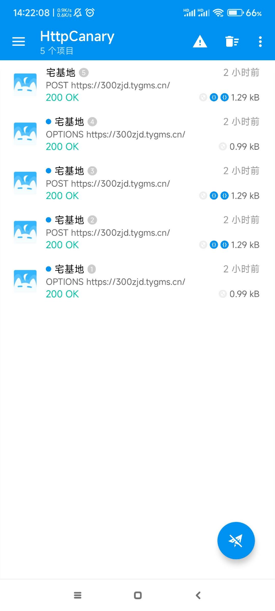
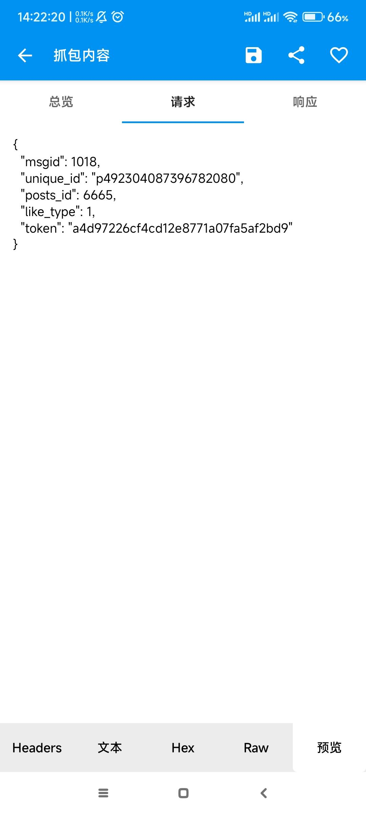
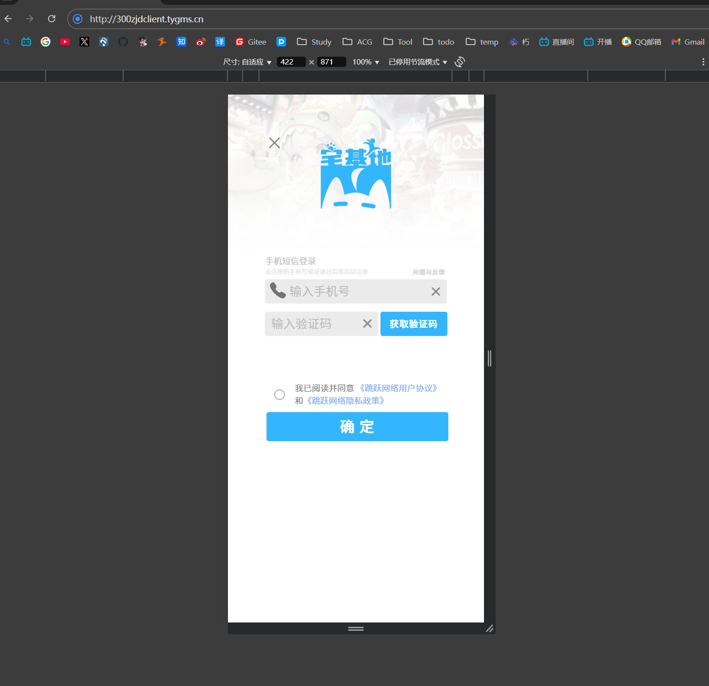
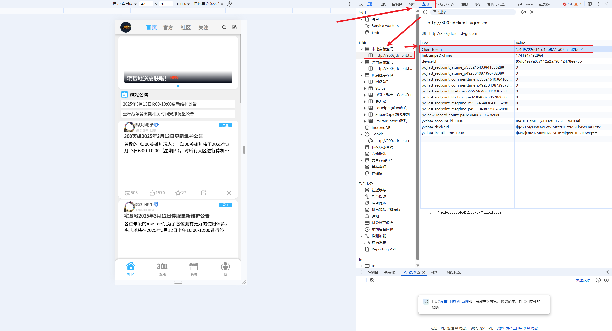

# 300英雄宅基地自动完成每日任务
目前存在的问题：
1. token过期时间未知，过期需更改配置文件
2. 代码未经过完全测试，仅供参考
3. 脚本逻辑不完整，主打一个能跑就行
4. sbty暂时未添加验证码校验，加了就寄

## 使用说明
1. 获取token，并填写到config.yaml中
2. 服务器/本机定时执行（推荐青龙面板）

推荐放到服务器上使用青龙面板定时执行（因为存在ty服务器或者本地网络抽风的问题，而且本人懒得做判断接口是否调用成功的判断，所以建议每隔几个小时执行一次完事）

## 获取token的方法

1. 手机抓包（推荐，但或许需要root权限）
   这里使用了HttpCanary，点击左上角选择目标应用中选择宅基地，右下角开启抓包后打开宅基地即可抓包

   

   随便选个贴子，点个赞，然后回到HttpCanary，选择刚刚点赞抓到的包，预览，找到token

   
2. PC浏览器抓包（会与手机宅基地相互挤号，因此不推荐，作为方法1无法使用时的下位）
   进入[http://300zjdclient.tygms.cn/]
   使用手机验证码登录
   
   然后按f12，依次点击“应用”，“本地存储空间”，找到ClientToken，复制value（注意，不需要双引号）
   
